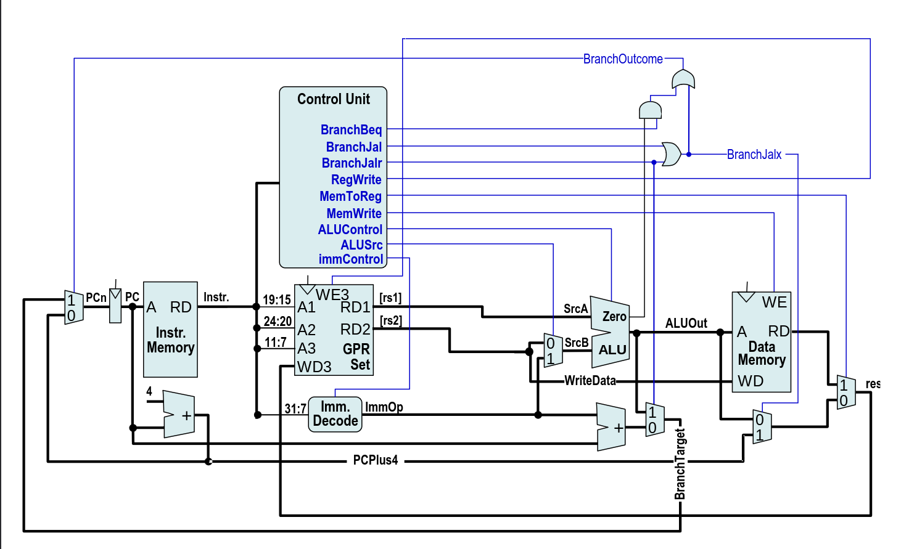

# RISCV-CPU
This is a semestral work that was assigned to us in the subject: Architecture of Computer Systems. The goal was to describe a simple RISCV CPU in the Verilog HDL. We had to implement 18 basic instructions and write a simple assembly program running on the described CPU.

The CPU uses a modified implementation of the diagram bellow.

### Contents
=========================================
- [Assembly](./asm_src/)
    Basic assembly programs used for testing. Also contains [the program](./asm_src/Matyas_Budsky_prog1.asm) required by the assignment.

- [Verilog](./verilog_src/)
    Contains the [CPU description](./verilog_src/Budsky_Matyas_CPU.v), along with additional source files provided to us by our teacher.

- [Testbenches](./testbenches/)
    Basic unit tests for the more complex CPU circuits.

Most files lack propper documentation, but with the provided diagram, it shouldn't be a big issue.
